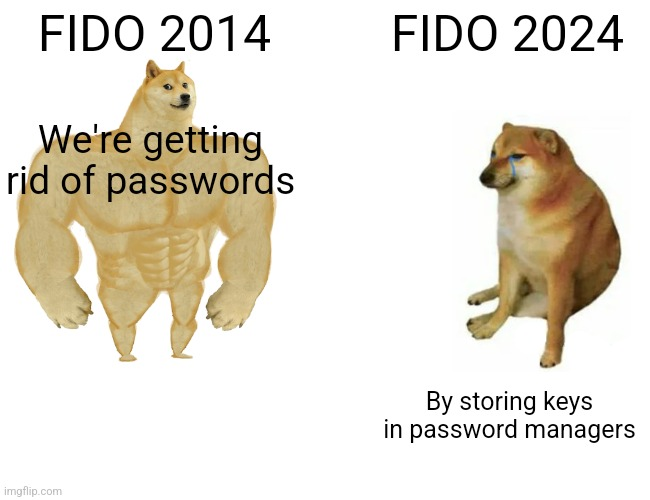

# Passkeys : The Good, The Bad, The Ugly

Slides and sample code from the [Devcon 7 presentation](https://app.devcon.org/schedule/XFLPAR)

The sample code will allow you to dump your own syncable Passkeys on iOS (tested on 18.1) and Android (tested on 15) devices. Some assembly required, read the slides first. 

## iOS

Jailbreak your device (for example with [palera1n](https://palera.in/) rootless)

Install SSH on your device and configure it (install NewTerm, sudo passwd root)

Install sshpass on your laptop and the Python dependencies (pycryptodome, sqlite3)

Grab your keychain (/private/var/Keychains/keychain-2.db)

Build or grab *keyclass_unwrapper* from https://github.com/xperylabhub/ios_keychain_decrypter/ then upload it to your device in /tmp, and set the executable permission (chmod a+x /tmp/keyclass_unwrapper)

Modify *IP* and *PASSWORD* in *decrypt_itemV8.py* to match your configuration

Dump the WebAuthn items with *dump_webauthn.py*

Decrypt a specific item with *decrypt_itemV8.py item*

## Android 

Jailbreak your device (for example with [Magisk](https://github.com/topjohnwu/Magisk))

Install and set up [Frida](https://frida.re/docs/android/)

Find the GMS process as explained in the slides (PID)

Run *frida -U PID -l frida-dump.js*

